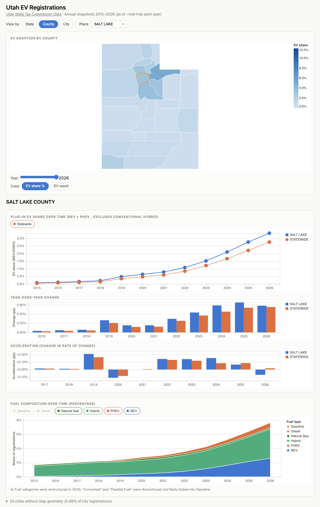

# Utah EV Registration Study



Curated dataset of Utah on-highway vehicle registrations by fuel type, 2015–2025, extracted
from the Utah State Tax Commission annual workbooks.

## Outputs (`data/`)

| file | granularity | years | rows |
|---|---|---|---|
| `registrations_by_county.csv / .json` | county × year × vehicle type × fuel | 2015–2025 | — |
| `registrations_by_city.csv / .json` | city × year × vehicle type × fuel | **2018–2025 only** | — |
| `meta.json` | provenance, fuel vocabulary by year, caveats | — | — |

**City coverage starts in 2018** because city-level fuel tables do not exist in the 2015–2017 workbooks.

## Schema

The extracted data (both CSV and JSON) follow this format.

County files:

| column | type | notes |
|---|---|---|
| `year` | int | snapshot year |
| `county` | string | normalized name (prefix `NN - ` stripped) |
| `county_code` | int \| null | 1–29, 99 = out of state |
| `vehicle_type` | string | Passenger - Standard, Light Truck, Heavy Truck, Motorcycle - Standard, Passenger - Low Speed |
| `fuel_raw` | string | verbatim label from source, stripped |
| `fuel` | string | canonical bucket (BEV, PHEV, Hybrid, Gasoline, Diesel, …) |
| `ev_class` | string | BEV, PHEV, Hybrid, or Non-electrified |
| `count` | int | registration count; zero rows omitted |

City files: same but `city` replaces `county`/`county_code`.

## Regenerating

The pipeline is two steps: extract → build.

### 1. Extract raw data

```bash
pip install -r requirements.txt
python extract.py
```

Reads all `*registrations.xlsx` workbooks in the project root and writes normalized CSVs/JSON to `data/`. The script validates its own output by checking row sums against the `TOTAL` column in each source sheet, then asserts cross-year sanity (county/city set sizes, rising BEV trend, spot checks of known values). It will fail loudly if anything looks wrong rather than emitting quietly-wrong data.

### 2. Rebuild the dashboard

```bash
python build_dashboard.py
```

Reads the CSVs produced by `extract.py`, computes pivot tables and aggregates, and injects the results as inline data constants into `index.html`. The script treats `index.html` as the source of truth for all HTML/CSS/JS — it only replaces the `const COUNTY_PIVOT = ...`, `const STATE_SHARE = ...`, etc. blocks, so hand-edits to the page logic survive a rebuild.

### Adding a new year

1. Download the new workbook from the [Utah State Tax Commission](https://tax.utah.gov/commission/econstats/mv/registrations/) and place it in the project root named `YYYYregistrations.xlsx`.
2. Run `python extract.py` then `python build_dashboard.py`.
3. The year range in the subtitle and all data constants update automatically.

## Known caveats

1. **City coverage is partial.** The source states: *"City is determined by address as reported
   by the vehicle owner. Only select cities are included."* City counts do **not** sum to the
   state total — using city data to compute share-of-Utah would be wrong.

2. **2020 vocabulary break.** The fuel-type labels were completely restructured between 2019 and
   2020 — `Converted`, `Flexible`, and `Natural Gas` vanished and were most likely folded into
   `Gasoline`. This creates a visible step in those canonical series. Annotate it in any time-
   series chart rather than smoothing it.

3. **Accuracy caveats from the source:** Hybrid, Electric, and CNG counts are only as accurate
   as manufacturer-provided data; Converted and Propane counts only as accurate as owner-
   reported data.

4. **`Passenger - Low Speed`** vehicle type disappears from the source starting in 2023.

5. **`HEBER`** city has problems... I still need to look into it.

6. **These are snapshots, not flows.** Each file represents registrations active as of
   approximately mid-February of that year. Year-over-year deltas are net fleet change, not new
   registrations.

## Sources

**Registration data:** Utah State Tax Commission, Economics and Statistical Unit — *Utah Current Registrations*, annual workbooks 2015–2026.

**Geography:**
- County boundaries: [us-atlas](https://github.com/topojson/us-atlas) (Census Bureau TIGER/Line), filtered to Utah FIPS `49*`, simplified 12% with mapshaper.
- City/place boundaries: U.S. Census Bureau, TIGER Cartographic Boundary Files 2023 (`cb_2023_49_place_500k`), simplified 5% with mapshaper.
